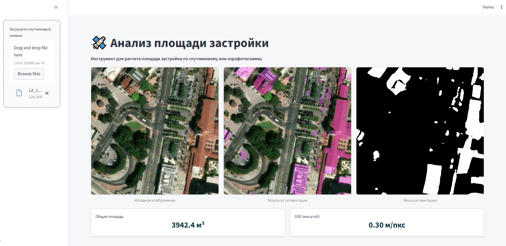
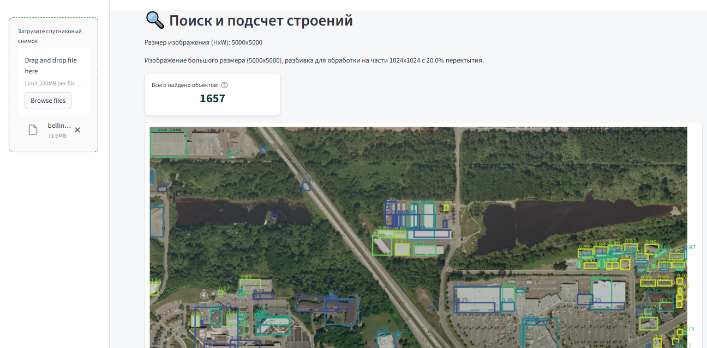

# Анализ площади застройки по спутниковым и аэрофотоснимкам

В данном репозитории представлены результаты проекта по автоматическому определению и расчету площади застройки. Система использует алгоритмы компьютерного зрения для обработки  снимков земной поверхности.

## Описание проекта

Основная цель работы — создание инструмента для сегментации строений, определения масштаба изображения и автоматического вычисления площади застройки.

- **Источник данных:** Работа производилась на основании открытого датасета [Inria Aerial Image Labeling](https://project.inria.fr/aerialimagelabeling/). Датасет предоставляет аэрофотоснимки высокого разрешения, известного пространственного разрешения (0.3 м/пиксель) с соответствующими масками зданий. Датасет изначально содержит большие изображения (5000x5000 пикселей).
    
- **Задачи проекта:**
  
    1) Обучение модели для семантической сегментации строений.
    2) Разработка алгоритма определения масштаба снимка.
    3) Расчет фактической площади застройки в квадратных метрах.
    4) Обучение дополнительной модели детекции для локализации отдельных строений на снимке.

Для демонстрации работы обученных моделей реализовано веб-приложение на базе **Streamlit**.

## Установка и запуск

Инструкция по настройке окружения (venv) и запуску приложения доступна в отдельном файле:

👉 **[Инструкция по установке (INSTALL.md)](https://github.com/shalfei/satellite_images_building_area/blob/main/INSTALL.md)**

## Техническая реализация

Для достижения поставленных целей были использованы следующие подходы и архитектуры:

### 1. Сегментация строений

Для выделения масок зданий была разработана гибридная архитектура:

- **Архитектура:** UNet-подобная структура: Интеграция skip-connections, характерных для U-Net, для более эффективной передачи контекстной информации от энкодера к декодеру, а также добавление блока **ASPP** (Atrous Spatial Pyramid Pooling) для захвата контекста на разных масштабах.
    
- **Энкодер:** В качестве бэкбоуна использованы слои предобученной модели **ResNet-34**.
    
- **Функция потерь:** Предварительно на базовой модели были протестированы  различные комбинации функций потерь для сегментации. В качестве базовой модели использовалась архитектура на основе ResNet34, предобученная на ImageNet, с модифицированным декодером для сегментации и отдельной головой для регрессии GSD.
Лучший результат показала комбинация **Dice + Focal + Boundary Loss:** 

Для оценки обобщающей способности модели GSD был собран и использован внешний тестовый датасет с помощью API ArcGIS. Изображения были получены для различных городов (включая города из обучающей выборки Inria, европейские города, а также города РФ) на разных уровнях зума. Для каждого изображения было рассчитано фактическое GSD на основе спецификации Web Mercator.

- **Результат:**
Модель показала меньшую ошибку на городах, аналогичных обучающей выборке (например, Остин, Китченер).
На новых географических регионах (например, Париж, Санкт-Петербург, Токио) ошибка GSD была выше.
Модель испытывает трудности с предсказанием GSD на снимках с большим количеством воды или обширными тенями, так как обучающий датасет содержит обработанные аэрофотоснимки и не содержит съемки под углом или больших теней.

- **Подготовка инференса**
Разработан пайплайн для инференса, который позволяет:

- Принимать на вход произвольные изображения.
- При необходимости автоматически нарезать большие изображения на патчи 512x512, обрабатывать их, а затем реконструировать полную маску и усреднять предсказанный GSD.
- Визуализировать результаты: исходное изображение, карту вероятностей сегментации и наложенную бинарную маску.
- Пайплайн был использован для реализации в приложении.

### 2. Детекция объектов

Для быстрой локализации и подсчета количества строений была обучена модель детекции:

- **Модель:** **YOLOX**.
    
- **Инициализация:** Классы для сборки модели были взяты из репозитория авторов оригинальной статьи.
https://github.com/Megvii-BaseDetection/YOLOX/tree/main
Использовались предзагруженные веса (Pre-trained weights) для конфигурации **YOLOX-L**.

- **Цикл обучения:**  Цикл был выстроен в соответствие с рекомендациями, приведенными в статье. 
Было обучено 300 эпох. Было применено управляемое значение скорости обучения:
1) Базовая скорость обучения (base_lr) обычно указывается для батча размером 64. Если используемый batch_size отличается, то максимальное значение (max_lr) масштабируется пропорционально.
2) Фаза Cosine Annealing:
После этапа прогрева скорость обучения следует графику косинусного затухания. Это позволяет плавно уменьшать LR к концу обучения.
3) Управление аугментациями и L1 Loss: Согласно рекомендациям авторов YOLOX, за 15 эпох до конца обучения (no_aug_epochs) отключаются мозаичные аугментации и включается L1 Loss. 

- **Результат:** Модель демонстрирует хорошие результаты на тестовой выборке, выделенной из обучающего датасета. Но если подать в модель изображение спутникового снимка невысокого разрешения, строения находятся гораздо хуже, т.к. уверенность модели на боксах очень низкая.
    

### 3. Исследовательские материалы

Все подробные шаги исследования, процесс предобработки данных, графики обучения и результаты экспериментов с описанием представлены в отдельных Jupyter-ноутбуках:

👉 **[Папка в репозитории](https://colab.research.google.com/drive/1hm2jkJpVNlzYv6sjhfglP4kzCBRe2CWO?usp=sharing)**

Если не хочется скачивать ноутбуки (Github не отображает содержимое из-за большого количества изображений внутри ноутбуков), ссылки на Collab:

👉 **[Google Collab Сегментация](https://colab.research.google.com/drive/1hm2jkJpVNlzYv6sjhfglP4kzCBRe2CWO?usp=sharing)**

👉 **[Google Collab Детекция](https://colab.research.google.com/drive/1Q5ixKwwHklsfoBxMkHtb9YsiW_mTNlXa?usp=sharing)**
